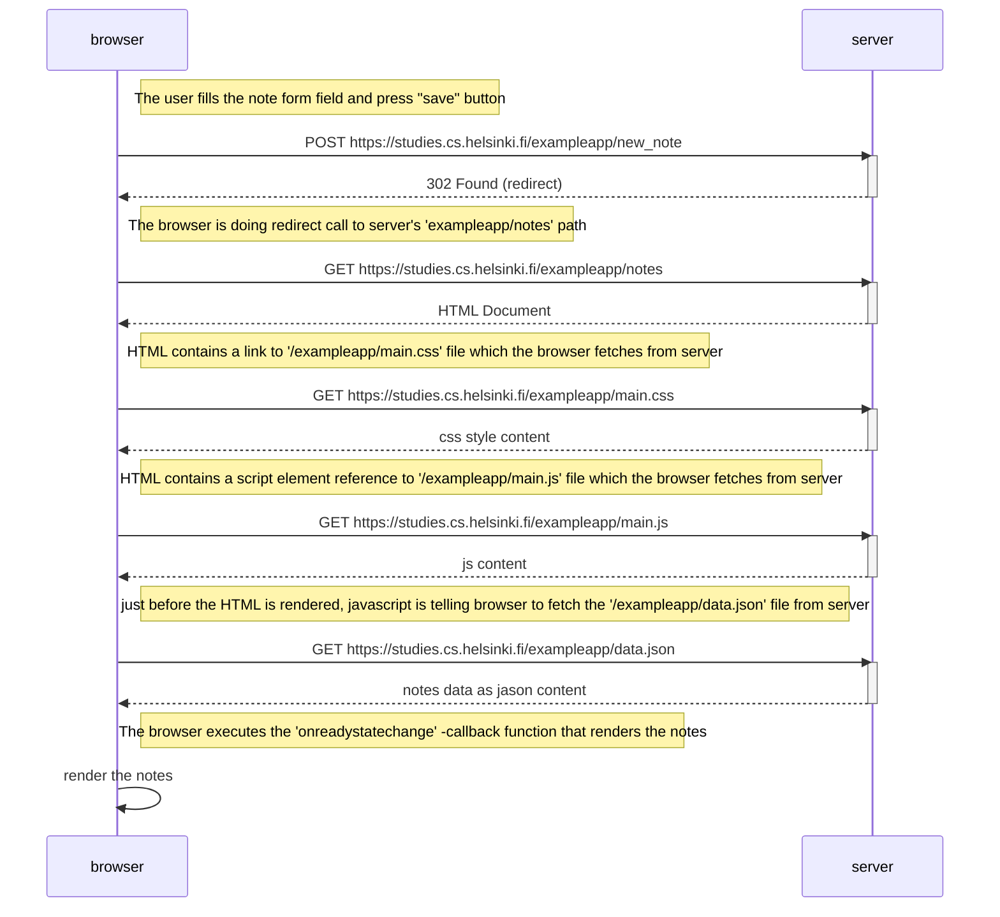

```mermaid
sequenceDiagram
    participant browser
    participant server

    Note right of browser: The user fills the note form field and press "save" button
    
    browser->>server: POST https://studies.cs.helsinki.fi/exampleapp/new_note
    activate server
    server-->>browser: 302 Found (redirect)
    deactivate server
    
    Note right of browser: The browser is doing redirect call to server's 'exampleapp/notes' path

    browser->>server: GET https://studies.cs.helsinki.fi/exampleapp/notes
    activate server
    server-->>browser: HTML Document
    deactivate server

    Note right of browser: HTML contains a link to '/exampleapp/main.css' file which the browser fetches from server
    
    browser->>server: GET https://studies.cs.helsinki.fi/exampleapp/main.css
    activate server
    server-->>browser: css style content
    deactivate server

    Note right of browser: HTML contains a script element reference to '/exampleapp/main.js' file which the browser fetches from server

    browser->>server: GET https://studies.cs.helsinki.fi/exampleapp/main.js
    activate server
    server-->>browser: js content
    deactivate server

    Note right of browser: just before the HTML is rendered, javascript is telling browser to fetch the '/exampleapp/data.json' file from server

    browser->>server: GET https://studies.cs.helsinki.fi/exampleapp/data.json
    activate server
    server-->>browser: notes data as jason content
    deactivate server

    Note right of browser: The browser executes the 'onreadystatechange' -callback function that renders the notes

    browser->>browser: render the notes

```