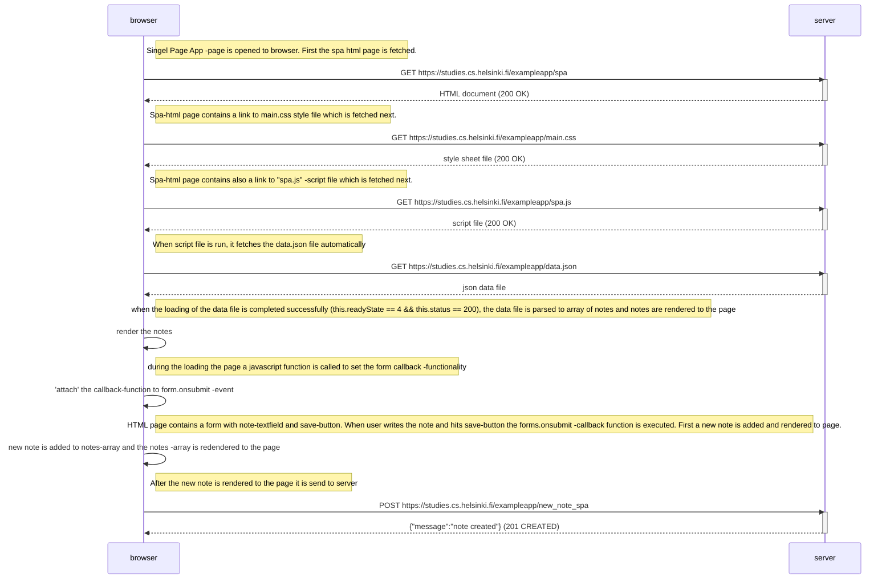

```mermaid
sequenceDiagram
    participant browser
    participant server

    Note right of browser: Singel Page App -page is opened to browser. First the spa html page is fetched.
    
    browser->>server: GET https://studies.cs.helsinki.fi/exampleapp/spa
    activate server
    server-->>browser: HTML document (200 OK)
    deactivate server
    
    Note right of browser: Spa-html page contains a link to main.css style file which is fetched next.

    browser->>server: GET https://studies.cs.helsinki.fi/exampleapp/main.css
    activate server
    server-->>browser: style sheet file (200 OK)
    deactivate server

    Note right of browser: Spa-html page contains also a link to "spa.js" -script file which is fetched next.

    browser->>server: GET https://studies.cs.helsinki.fi/exampleapp/spa.js
    activate server
    server-->>browser: script file (200 OK)
    deactivate server

    Note right of browser: When script file is run, it fetches the data.json file automatically
    
    browser->>server: GET https://studies.cs.helsinki.fi/exampleapp/data.json
    activate server
    server-->>browser: json data file
    deactivate server

    Note right of browser: when the loading of the data file is completed successfully (this.readyState == 4 && this.status == 200), the data file is parsed to array of notes and notes are rendered to the page 

    browser->>browser: render the notes    

    Note right of browser: during the loading the page a javascript function is called to set the form callback -functionality 

    browser->>browser: 'attach' the callback-function to form.onsubmit -event

    Note right of browser: HTML page contains a form with note-textfield and save-button. When user writes the note and hits save-button the forms.onsubmit -callback function is executed. First a new note is added and rendered to page.

    browser->>browser: new note is added to notes-array and the notes -array is redendered to the page

    Note right of browser: After the new note is rendered to the page it is send to server

    browser->>server: POST https://studies.cs.helsinki.fi/exampleapp/new_note_spa
    activate server
    server-->>browser: {"message":"note created"} (201 CREATED)
    deactivate server

```
